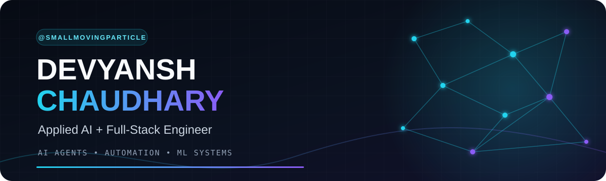
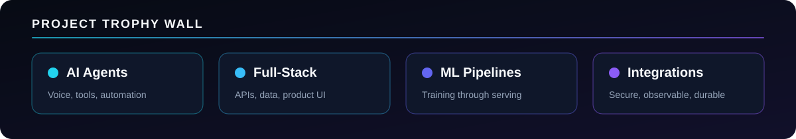

  

  

  
  
  
  

## What I build

I turn applied AI ideas into useful software: Python services, data tools, full-stack products, and
machine-learning applications. My public work spans automation, security, classification, regression, NLP,
and practical model-serving demos.

- **Applied machine learning:** classification, regression, NLP experiments, and model evaluation.
- **Python systems:** APIs, data ingestion, reusable training pipelines, and experiment tracking.
- **Full-stack products:** clear interfaces backed by dependable services and data workflows.

## Featured build — AI Outreach Platform

<table>
  <tr>
    <td width="50%" valign="top">
      <h3><a href="https://github.com/SmallMovingParticle/rpt_outbound_call_sms_agent">Outreach Agent Backend</a></h3>
      
A pre-production FastAPI system coordinating voice, messaging, scheduling, persistence, durable retries, and CRM handoffs.

      
<code>Python</code> <code>FastAPI</code> <code>PostgreSQL</code> <code>Docker</code>

    </td>
    <td width="50%" valign="top">
      <h3><a href="https://github.com/SmallMovingParticle/rpt_frontend">Operations CRM Frontend</a></h3>
      
A protected Next.js workspace for lead intake, outreach monitoring, appointments, review queues, templates, provider health, and analytics.

      
<code>TypeScript</code> <code>Next.js</code> <code>React</code> <code>Vercel</code>

    </td>
  </tr>
</table>

## More projects

| Project | What it demonstrates |
| --- | --- |
| [Network Security](https://github.com/SmallMovingParticle/networkSecurity) | End-to-end phishing detection with FastAPI, MongoDB, MLflow, and scikit-learn. |
| [Student Performance ML](https://github.com/SmallMovingParticle/ml_project1) | Modular training and prediction pipelines served through Flask. |
| [ANN Classification](https://github.com/SmallMovingParticle/annclassification) | TensorFlow customer-churn classification with a Streamlit interface. |
| [Forest Fire Prediction](https://github.com/SmallMovingParticle/forestfire) | Ridge-regression model served as a compact Flask application. |

## Technology stack

  

  
  
  
  
  

## GitHub signal

  
  

  

  

<picture>
  <source media="(prefers-color-scheme: dark)" srcset="assets/generated/contribution-snake-dark.svg">
  <source media="(prefers-color-scheme: light)" srcset="assets/generated/contribution-snake.svg">
  
</picture>

  

## Let's build something useful

I am open to applied AI, backend, full-stack, and machine-learning roles, as well as focused freelance
collaborations. The fastest way to reach me is
[email](mailto:chaudharydivyansh04@gmail.com) or
[LinkedIn](https://www.linkedin.com/in/devyansh-chaudhary-88643b15a/).
